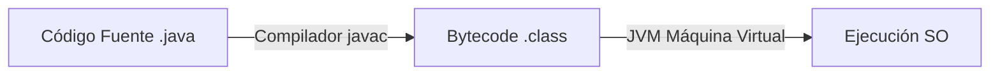

# UD01: Elementos de un programa informático

## 📝 Objetivos de la unidad
- Comprender el ciclo de desarrollo de un programa (código fuente, compilación y ejecución en la JVM).
- Conocer la estructura fundamental de un programa escrito en Java.
- Aprender a declarar y utilizar variables, constantes y tipos de datos primitivos.
- Dominar el uso de operadores aritméticos, relacionales y lógicos.

---

## 1. Conceptos generales de programación

Un **programa informático** es una secuencia de instrucciones que un ordenador ejecuta para realizar una tarea específica.



* **Lenguaje de alto nivel (Java):** Diseñado para ser legible por los humanos.
* **Compilación (`javac`):** Convierte el código fuente `.java` en un lenguaje intermedio llamado **Bytecode** (`.class`).
* **Java Virtual Machine (JVM):** Ejecuta el bytecode en cualquier sistema operativo (Windows, Linux, macOS), garantizando la portabilidad *"Write Once, Run Anywhere"*.

---

## 2. Estructura de un programa en Java

Todo código en Java se organiza dentro de **clases**. El punto de entrada principal para la ejecución de un programa es el método `main`.

```java
public class HolaMundo {

    public static void main(String[] args) {
        // Imprime un mensaje en la consola
        System.out.println("¡Hola, mundo!");
    }

}
```

!!! note "Elementos clave"
    - **`public class HolaMundo`**: El nombre del archivo debe coincidir exactamente con el de la clase pública (`HolaMundo.java`).
    - **`public static void main(String[] args)`**: Firma del método principal de ejecución.
    - **`System.out.println(...)`**: Instrucción para mostrar texto por pantalla seguido de un salto de línea.
    - **`;` (Punto y coma):** Cada sentencia finaliza con un punto y coma.

---

## 3. Variables, constantes y tipos de datos primitivos

Una **variable** es un espacio en memoria reservado para almacenar un valor que puede cambiar durante la ejecución del programa.

### 3.1. Tipos de datos primitivos en Java

| Tipo | Tamaño | Rango / Valor de ejemplo | Descripción |
| :--- | :--- | :--- | :--- |
| `byte` | 8 bits | `-128` a `127` | Entero muy pequeño |
| `short` | 16 bits | `-32.768` a `32.767` | Entero corto |
| `int` | 32 bits | `-2.147.483.648` a `2.147.483.647` | Entero estándar |
| `long` | 64 bits | Sufijo `L` (ej. `3000000000L`) | Entero grande |
| `float` | 32 bits | Sufijo `f` (ej. `3.14f`) | Decimal simple precisión |
| `double` | 64 bits | (ej. `3.1415926535`) | Decimal doble precisión (estándar) |
| `boolean` | 1 bit | `true` o `false` | Valor lógico |
| `char` | 16 bits | `'A'`, `'9'`, `'\n'` | Carácter único Unicode |

### 3.2. Declaración e inicialización

```java
// Declaración
int edad;

// Inicialización
edad = 20;

// Declaración e inicialización simultánea
double precio = 19.99;
boolean esMayorEdad = true;
char inicial = 'J';

// Constantes (su valor no se puede modificar)
final double PI = 3.14159;
```

!!! warning "Convención de nombres (camelCase)"
    - Variables y métodos: comienzan en minúscula y usan mayúscula intermedia (`edadUsuario`, `calcularTotal`).
    - Constantes: todo en mayúsculas separado por guiones bajos (`MAX_REINTENTOS`, `PI`).

---

## 4. Operadores

### 4.1. Operadores aritméticos
| Operador | Operación | Ejemplo (`a=10, b=3`) | Resultado |
| :---: | :--- | :--- | :--- |
| `+` | Suma | `a + b` | `13` |
| `-` | Resta | `a - b` | `7` |
| `*` | Multiplicación | `a * b` | `30` |
| `/` | División entera | `a / b` | `3` |
| `%` | Módulo (resto) | `a % b` | `1` |

### 4.2. Operadores relacionales
| Operador | Significado | Ejemplo (`a=10, b=3`) | Resultado |
| :---: | :--- | :--- | :--- |
| `==` | Igual a | `a == b` | `false` |
| `!=` | Distinto de | `a != b` | `true` |
| `>` | Mayor que | `a > b` | `true` |
| `<` | Menor que | `a < b` | `false` |
| `>=` | Mayor o igual que | `a >= b` | `true` |
| `<=` | Menor o igual que | `a <= b` | `false` |

### 4.3. Operadores lógicos
| Operador | Nombre | Descripción |
| :---: | :--- | :--- |
| `&&` | AND (Y lógico) | `true` solo si ambas condiciones son verdaderas |
| `\|\|` | OR (O lógico) | `true` si al menos una condición es verdadera |
| `!` | NOT (Negación) | Invierte el valor de verdad (`!true` es `false`) |

---

## 5. Entrada y salida básica por consola

Para leer datos introducidos por el usuario mediante teclado se utiliza la clase `Scanner`.

```java
import java.util.Scanner;

public class EntradaDatos {

    public static void main(String[] args) {
        Scanner teclado = new Scanner(System.in);

        System.out.print("Introduce tu nombre: ");
        String nombre = teclado.nextLine();

        System.out.print("Introduce tu edad: ");
        int edad = teclado.nextInt();

        System.out.println("Hola " + nombre + ", tienes " + edad + " años.");

        teclado.close();
    }

}
```

---

## 💻 Ejercicios propuestos

### Ejercicio 1: Cálculo de Área y Perímetro
Crea un programa que declare las variables `ancho` (double) y `alto` (double) de un rectángulo. Calcula y muestra por consola su área (`ancho * alto`) y su perímetro (`2 * (ancho + alto)`).

### Ejercicio 2: Conversor de Temperatura
Pide al usuario una temperatura en grados Celsius y conviértela a Fahrenheit usando la fórmula:
$$\text{Fahrenheit} = \text{Celsius} \times \frac{9}{5} + 32$$

### Ejercicio 3: Evaluación de Condiciones Lógicas
Declara tres variables enteras `a = 15`, `b = 20` y `c = 15`. Muestra el resultado booleano (`true`/`false`) de las siguientes expresiones:
1. `(a == c) && (a < b)`
2. `(a > b) || (b != c)`
3. `!(a == c)`
